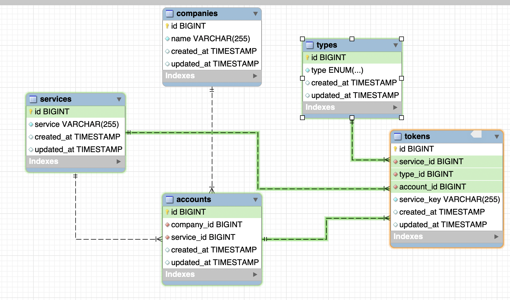

# ПОЛУЧИТЬ ДАННЫЕ ПО API и СОХРАНИТЬ В БД

**HomeController** - начинает работу при запуске приложения
1. Передает параметры запросы в ApiService (app/Services/ApiService.php);
   При стандартном запросе на получение всех данных в интересующий период
   требуется указать только даты:
   'dateFrom' => '2023-08-25',
   'dateTo' => '2023-08-31',
   Если остальные параметры отсутствуют - ApiService установит их из констант.
2. Запускает метод getData в ApiService и выводит на странице результат работы.

**ApiService** - вызывается из HomeController
1) setParams(array $params) - устанавливает параметры запроса;
2) getData(string $section) - осуществляет запрос по одному разделу
- получает данные по 0 странице;
- получает количество страниц;
- получает данные по остальным страницам;
- вызывает метод saveToDb($data, $section) в DbService (app/Services/DbService.php) для сохранения данных в БД;
- возвращает ответ в контроллер (успех/ошибка);
- запись в БД производится постранично.
3) getOnePageData(string $section, int $page) - получить данные одной страницы

**DbService** - вызывается из ApiService
saveToDb($data, $section) - сохраняет данные в БД

**Модели**
- Income
- Order
- Sale
- *При запросе к разделу **stocks** - ошибка. Информация об ошибке выводится на странице*

# Вторая часть - Task Scheduling, Artisan Console

**Таблицы в БД**
- companies
- services - (API)
- tokens
- types
- accounts
***
- incomes
- orders
- sales
- stocks

**Ввод данных клиентов с консоли и сохранение в БД**

**Ежедневное обновление данных дважды в день**
Вывод информации о загрузке в терминал - crontab

